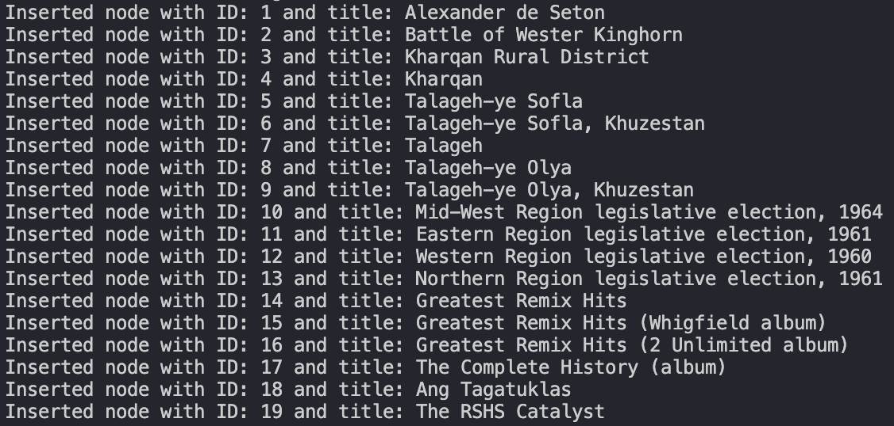
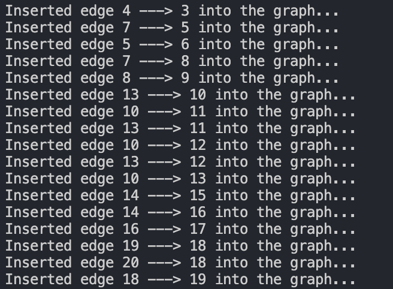
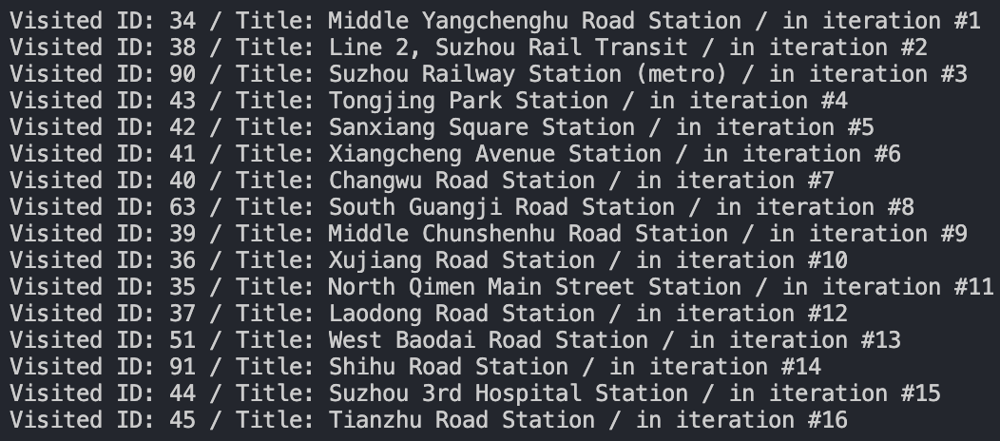
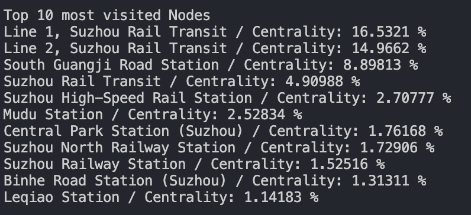

# Results


### Group members:

* sg49

* ambala2

* danahar2

 

## Parsing

 

Our ```Parser``` class converts the input text file of nodes and articles and converts it to a form that can be passed into the ```graph``` contructor:

 

Inserting nodes give us:



 

Inserting edges gives us:



 

## BFS

 

Our BFS algorithm takes in input in the form:

```

BFS trav;

trav.printBFS(34, 45, graph);

```

this gives us the output:



 

## Dijkstra

 

Our Dijkstra algorithm takes in input in the form:

```

Dijkstras d;

vector<long int> shortestPath = d.dijkstra(34, 45, graph);

```

Printing out the vector will give us

this gives us the output:

 


 

## Betweenness Centrality

 

Our Betweenness Centrality algorithm takes in input in the form:

```

Betweenness b;

vector<pair<float, long int>> betw = b.mapBetweenness(graph);

```

Printing out the vector will give us

this gives us the top 10 most central nodes:

 



 

## Conclusion

 

1. Our parsing algorithm successfully makes the graph for large and small datasets.

2. The BFS of the graph runs in O(m+n) time and iterates the graph as expected by the implementation

3. The six degrees of separation between two articles hypothesis is somewhat true, and for any given connected component in the dataset, the longest shortest path was 8 according to the results from Dijkstra’s algorithm for the whole dataset, and usually was around 5 in the a normal dataset

4. Betweenness centrality, having a worst case runtime of O(V^3), worked well for smaller sections of the dataset (~100 nodes) but struggled with larger values. This is not a problem with our implementation, but of the algorithm itself.

5. The wikipedia database is quite well connected, with the maximum centrality value being of the article “Line 1, Suzhou Rail Transit” having a centrality of 16.5321%

 